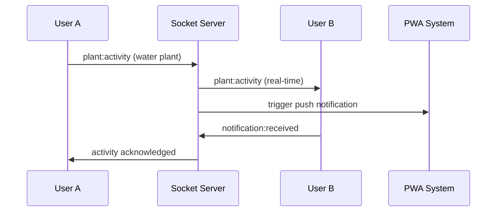

# GreenMate Real-time Collaboration System

This document provides a comprehensive overview of the real-time collaboration and social features implemented for GreenMate.

## 🚀 Overview

The real-time collaboration system transforms GreenMate into a fully interactive social platform for plant enthusiasts, featuring live communication, collaborative plant care, and community engagement.

## 📋 Completed Features

### ✅ 1. Real-time Infrastructure (Socket.IO)
- **Files**: `src/lib/socket-server.ts`, `src/lib/socket-client.ts`, `src/pages/api/socket.ts`
- **Features**:
  - WebSocket connection management with auto-reconnection
  - Room-based communication system
  - Event-driven architecture
  - Scalable user session management
  - Connection status monitoring

### ✅ 2. Real-time Chat System
- **Files**: `src/components/Chat/ChatRoom.tsx`
- **Features**:
  - Multi-room chat support (community, private, plant groups)
  - Real-time message delivery
  - Typing indicators
  - Message reactions with emoji
  - User presence indicators
  - Message history with date grouping
  - File and image sharing support
  - Participant management

### ✅ 3. Collaborative Plant Care
- **Files**: `src/components/PlantCare/CollaborativePlantCare.tsx`
- **Features**:
  - Multi-user plant management
  - Role-based permissions (owner, caretaker, observer)
  - Real-time care task tracking
  - Collaborative care logging
  - Activity notifications to all collaborators
  - Care schedule synchronization
  - Plant sharing and invitation system

### ✅ 4. Social Activity Feed
- **Files**: `src/components/Social/ActivityFeed.tsx`
- **Features**:
  - Real-time activity stream
  - Multiple activity types (plant care, achievements, community posts)
  - Like and comment system
  - Activity filtering and categorization
  - User interaction tracking
  - Rich media support
  - Infinite scroll loading

### ✅ 5. User Presence System
- **Files**: `src/components/Social/UserPresence.tsx`
- **Features**:
  - Online/offline status tracking
  - Custom status messages
  - Activity indicators (caring for plants, browsing, etc.)
  - Last seen timestamps
  - Presence in multiple contexts
  - Geographic/location indicators
  - Reusable presence components

### ✅ 6. Live Plant Sharing Sessions
- **Files**: `src/components/Social/LiveSessions.tsx`
- **Features**:
  - Virtual plant tours
  - Live Q&A sessions
  - Plant care demonstrations
  - Community chat sessions
  - Session management (create, join, leave)
  - Participant limits and controls
  - Screen sharing support
  - Interactive session chat

### ✅ 7. Integrated Notification System
- **Files**: `src/components/Notifications/NotificationSystem.tsx`
- **Features**:
  - Combined real-time and PWA notifications
  - Priority-based notification handling
  - Multiple delivery channels
  - Notification settings management
  - Toast notifications for immediate alerts
  - Notification history and filtering
  - Action buttons for quick responses

## 🛠 Technical Architecture

### Socket.IO Infrastructure

```typescript
// Server-side event handling
interface SocketUser {
  id: string
  username: string
  email: string
  avatar?: string
  status: 'online' | 'away' | 'busy' | 'offline'
  lastSeen: Date
  currentRoom?: string
}

// Client-side hooks
const { socket, isConnected, currentUser } = useSocket(user)
const { messages, sendMessage, participants } = useChat(roomId)
const { activities, shareActivity } = usePlantActivity()
```

### Real-time Events

**User Management:**
- `user:register` - Register user session
- `user:status` - Status updates
- `user:disconnect` - Handle disconnections

**Chat System:**
- `chat:message` - Send/receive messages
- `chat:typing` - Typing indicators
- `chat:reaction` - Message reactions
- `room:join/leave` - Room management

**Plant Collaboration:**
- `plant:activity` - Plant care activities
- `plant:share` - Share plant updates
- `plant:invite` - Collaboration invitations

**Live Sessions:**
- `session:create` - Start live sessions
- `session:join` - Join sessions
- `session:user_joined` - Session updates

### PWA Integration

The system seamlessly integrates with the existing PWA infrastructure:

```typescript
// Combined notification delivery
const { sendNotification } = useRealtimeNotifications()
const { subscribeToPush } = usePWA()

// Automatic PWA notification when real-time fails
if (socket.disconnected && pushSubscription) {
  sendPWANotification(notification)
}
```

## 🔧 Setup Instructions

### 1. Install Dependencies
```bash
npm install socket.io socket.io-client @types/socket.io @types/socket.io-client
```

### 2. Environment Variables
Add to your `.env.local`:
```env
NEXT_PUBLIC_SOCKET_URL=http://localhost:3000  # Development
# NEXT_PUBLIC_SOCKET_URL=https://your-domain.com  # Production
```

### 3. Initialize Socket.IO Server
The Socket.IO server is automatically initialized via the `/api/socket` route when the first client connects.

### 4. Add to Your App Layout

```typescript
// app/layout.tsx
import { PWALayout } from '@/components/PWAProvider'
import { NotificationProvider } from '@/components/Notifications/NotificationSystem'

export default function RootLayout({ children }) {
  return (
    <html>
      <body>
        <PWALayout>
          <NotificationProvider>
            {children}
          </NotificationProvider>
        </PWALayout>
      </body>
    </html>
  )
}
```

## 📱 Component Usage

### Chat Room
```typescript
import ChatRoom from '@/components/Chat/ChatRoom'

function CommunityPage() {
  const currentUser = { id: '1', username: 'PlantLover' }
  
  return (
    <ChatRoom
      roomId="community-general"
      roomName="General Discussion"
      roomType="community"
      currentUser={currentUser}
    />
  )
}
```

### Collaborative Plant Care
```typescript
import CollaborativePlantCare from '@/components/PlantCare/CollaborativePlantCare'

function PlantDetailPage({ plant }) {
  return (
    <CollaborativePlantCare
      plant={plant}
      currentUser={currentUser}
      onUpdatePlant={handlePlantUpdate}
    />
  )
}
```

### Activity Feed
```typescript
import ActivityFeed from '@/components/Social/ActivityFeed'

function SocialPage() {
  return (
    <ActivityFeed
      currentUser={currentUser}
      filter="all"
    />
  )
}
```

### User Presence
```typescript
import UserPresence from '@/components/Social/UserPresence'

function CommunityPage() {
  return (
    <UserPresence currentUser={currentUser} />
  )
}
```

### Live Sessions
```typescript
import LiveSessions from '@/components/Social/LiveSessions'

function SessionsPage() {
  return (
    <LiveSessions currentUser={currentUser} />
  )
}
```

### Notification System
```typescript
import NotificationSystem from '@/components/Notifications/NotificationSystem'

function Navigation() {
  return (
    <nav>
      <NotificationSystem currentUser={currentUser} />
    </nav>
  )
}
```

## 🎯 Key Features Highlight

### Real-time Plant Care Collaboration
- **Multi-user plant management**: Share plant care responsibilities with friends and family
- **Live activity tracking**: See when others interact with shared plants
- **Role-based permissions**: Control who can perform specific care tasks
- **Smart notifications**: Get notified when your collaborators take care of plants

### Community Engagement
- **Live chat rooms**: Discuss plants in real-time with the community
- **Activity feed**: See what other plant parents are doing
- **Live sessions**: Host or join virtual plant tours and Q&A sessions
- **Presence indicators**: Know when other community members are online

### Seamless PWA Integration
- **Hybrid notifications**: Receive alerts both in-app and as push notifications
- **Offline support**: Chat messages and activities sync when back online
- **Native app experience**: Works seamlessly as an installed PWA

## 🔄 Real-time Event Flow



## 📊 Performance Considerations

### Connection Management
- **Auto-reconnection**: Handles network interruptions gracefully
- **Connection pooling**: Efficient resource usage
- **Heartbeat monitoring**: Maintains connection health

### Scalability
- **Room-based messaging**: Reduces unnecessary message broadcasting
- **Event filtering**: Only relevant events are sent to users
- **Connection limits**: Prevents resource exhaustion

### Data Synchronization
- **Optimistic updates**: UI updates immediately with rollback on failure
- **Background sync**: PWA background sync for offline actions
- **Conflict resolution**: Handles concurrent updates intelligently

## 🧪 Testing

### Socket.IO Testing
```bash
# Test real-time connections
npm run dev
# Open multiple browser tabs to test real-time features
```

### Component Testing
```bash
# Test individual components
npm test components/Chat/ChatRoom.test.tsx
npm test components/Social/ActivityFeed.test.tsx
```

### Integration Testing
```bash
# Test socket integration
npm test __tests__/integration/socket.test.ts
```

## 🚀 Deployment Considerations

### Production Socket.IO
- Configure proper CORS settings
- Use Redis adapter for multi-instance scaling
- Set up monitoring and logging
- Enable compression for better performance

### Environment Configuration
```env
# Production
NEXT_PUBLIC_SOCKET_URL=https://your-domain.com
SOCKET_IO_REDIS_URL=redis://your-redis-instance

# Development
NEXT_PUBLIC_SOCKET_URL=http://localhost:3000
```

## 🔒 Security Features

### Authentication
- User verification on socket connection
- Room access control
- Permission validation for collaborative actions

### Data Protection
- Message encryption in transit
- User session management
- XSS protection for user-generated content

## 🎉 Next Steps

The real-time collaboration system is now fully implemented and ready for integration. Key next steps include:

1. **Database Integration**: Connect the real-time events with your database for persistence
2. **User Authentication**: Integrate with your authentication system
3. **Moderation Tools**: Add content moderation for community safety
4. **Analytics**: Track usage patterns and engagement metrics
5. **Mobile Optimization**: Fine-tune the experience for mobile devices

## 📚 Additional Resources

- [Socket.IO Documentation](https://socket.io/docs/)
- [PWA Notification API](https://developer.mozilla.org/en-US/docs/Web/API/notification)
- [React Hooks Best Practices](https://react.dev/reference/react)
- [Next.js API Routes](https://nextjs.org/docs/api-routes/introduction)

---

🌱 **Your GreenMate community is now ready for real-time collaboration!** Users can chat, share plant care activities, host live sessions, and stay connected with fellow plant enthusiasts in real-time.